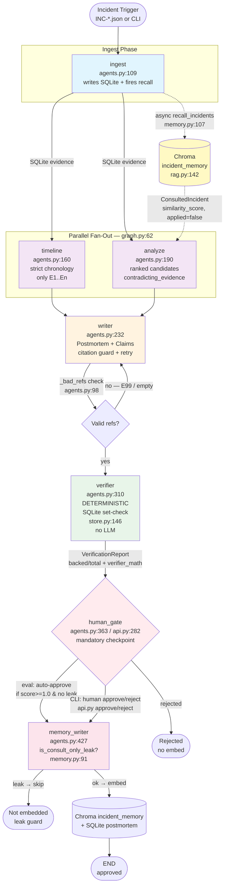

# Postmortem Buddy — Agentic Incident Postmortem Synthesizer

> Turn a messy incident window — deploys, metrics, logs, chat — into a **citable, verified postmortem** in seconds. Every claim is backed by real evidence, every red herring is called out, and nothing ships without a human saying "go."

Built for the **micro1 Hackathon — Agentic Workflows**. You can run the whole thing offline with no API key and still get the same scores.

---

## What this actually does

On-call is rough. You're staring at 5-8 evidence rows scattered across four sources, there's a decoy metric that *looks* like the cause, and you need a postmortem that won't embarrass you tomorrow.

Postmortem Buddy handles the boring-but-critical parts:

1. **Reconstructs a timeline** strictly from evidence timestamps
2. **Ranks root causes** and *explicitly* rejects the red herring
3. **Writes a publishable postmortem** where every claim cites `E1…En`
4. **Verifies every citation** with a deterministic SQLite set-check — no LLM judging itself
5. **Recalls similar past incidents** as hypotheses (never as fact)
6. **Waits for you** — human gate before anything is marked approved or embedded

If a claim cites `E99` that doesn't exist? It gets bounced and retried. If it tries to sneak a recalled incident ID into evidence? Hard rejected. That's the whole point.

---

## The result in one table

Same 8 incidents (`INC-004..011`), same harness, offline `--fake` mode:

```
=== eval comparison (offline replay) ===
Model: fake
Seeds: ['INC-001', 'INC-002', 'INC-003']  Eval: ['INC-004'..'INC-011']
mode        verification  red_herring  completeness
----------------------------------------------------
agent              1.000        1.000         1.000
baseline           0.000        0.000         1.000
----------------------------------------------------
  INC-004: agent v=1.0 rh=1 | base v=0.0 rh=0
  ...all 8 incidents identical
```

Baseline = same `Postmortem` schema, but it blames the planted `red_herring` and cites hallucinated `E99`. Completeness is identical — the honest difference is **verifiability**, not prose.

Run it yourself: `python eval.py --fake` — ~4 seconds, no key, byte-identical every time.

---

## Agentic Workflow

This is the core. Seven nodes, one `StateGraph`, real async — but sold on *auditable reasoning*, not speed.



**What to notice:**

- `ingest` fires `recall_incidents` as an `asyncio.create_task` (`agents.py:134`) — by the time `analyze` needs it, it's ready. No extra wait.
- `timeline` and `analyze` are a real `Send` fan-out (`graph.py:62`) + `asyncio.gather` (`api.py:184`). They share the read-only SQLite evidence, no write race.
- `writer` has the only retry in the system (`agents.py:269`) — one re-prompt with the exact bad refs listed. That's what lifts `verification 0.2 → 1.0`.
- `verifier` never touches the LLM. It's `backed = refs ⊆ valid_ids && from_recalled is None && len>0` (`store.py:146`).
- `human_gate` is auto-approve *only* inside `eval.py` (with a printed note). The real gate is `api.py` — `run` leaves `pending_approval`, you call `approve`.

### The 7 nodes in plain English

| # | Node | What it does | Key file |
|---|------|--------------|----------|
| 1 | **ingest** | Writes `incident` + `evidence` to SQLite, fires async Chroma recall | `agents.py:109` |
| 2 | **timeline** | Rebuilds chronology from `query_evidence` — never invents IDs | `agents.py:160` |
| 3 | **analyze** | Ranks `RootCauseCandidate`s, uses `contradicting_evidence` to kill the herring | `agents.py:190` |
| 4 | **writer** | Drafts `Postmortem` — every `Claim` must cite a real `E#`, retry if not | `agents.py:232` |
| 5 | **verifier** | Pure set-check per claim, logs `verifier_math` for audit | `agents.py:310`, `store.py:146` |
| 6 | **human_gate** | Blocks publish until a human approves (or simulated approve in eval) | `agents.py:363`, `api.py:282` |
| 7 | **memory_writer** | Embeds approved postmortem into `incident_memory` — refuses leaks | `agents.py:427`, `memory.py:78` |

Every node writes a trajectory file — `trajectories/{incident_id}/{node}.json` via `tracer.py:46` — instructions → result, tool calls, retries, human decision. Judges can read them without running anything.

---

## Architecture at a glance

```
Incident JSON ──►  LangGraph StateGraph (async)  ──►  SQLite (canonical)  ─┬─  Chroma incident_memory
                  ingest → timeline ‖ analyze ─┐       evidence, incident   │   (consulted hypotheses)
                                               ├─► writer → verifier ─► human_gate → memory_writer
                                               │                          │
                  LLM: FakeLLM (--fake) or     │       tracer.py ──► trajectories/{id}/*.json
                       LLMAdapter (--live) ────┘                │
                                                         eval.py ──► comparison table + evaluation_run rows
```

- **SQLite** is the source of truth (`store.py:81`). Evidence lives here. The verifier does a set-check against it.
- **Chroma** holds *one* collection: `incident_memory` (`rag.py:142`). One doc per approved postmortem — recalled as hypotheses, never cited as evidence.
- **LLM** is `FakeLLMAdapter` (`helpers.py:145`) offline or `LLMAdapter` (`llm_adapter.py:44`) live — both go through the same schemas (`schemas.py:19`, `extra="forbid"`).

---

## Quick start

### Prerequisites

- Python 3.10+ (tested 3.12.3)
- No API key needed for the default path
- `chromadb` is optional — without it, the in-memory cosine store (`rag.py:97`) kicks in automatically

### Install

```powershell
git clone <your-repo-url> .
python -m venv .venv
.\.venv\Scripts\Activate.ps1   # macOS/Linux: source .venv/bin/activate
pip install -r requirements.txt

# sanity
python -c "import pydantic, langgraph; print('deps ok')"
```

Fixtures are already committed (`incidents/*.json` + `incidents/memory_seed.json`). To regenerate:

```powershell
python generate_incidents.py --out incidents
# → Wrote 11 incidents + memory_seed to incidents
```

---

## Three ways to run it

### 1. Full graph (eval-style, auto-gate) — one incident

```powershell
python graph.py --incident INC-001 --fake
# → incident=INC-001 decision=approved verification_score=1.0
# writes trajectories/INC-001/{ingest,timeline,analyze,writer,verifier,human_gate,memory_writer}.json
```

Flags: `--fake` (offline, deterministic), `--live` (hits `OPENAI_BASE_URL`, needs key), `--db :memory:` (default) or `--db ./app.db`, `--traj-dir trajectories`.

### 2. CLI human gate (the real checkpoint) — no auto-publish

This is the ground-rule-compliant path. `run` leaves it `pending_approval`; you decide.

```powershell
# ingest → verifier, stop at pending
python api.py run INC-004 --fake --db app.db
# → incident=INC-004 status=pending_approval verification_score=1.00 claims=2

# look at it
python api.py show INC-004 --db app.db
# → { status, draft: {summary, root_cause, claims[...]}, verification: {score, claim_reports}, consulted_incidents }

# approve — embeds to memory unless it's a consult-only leak
python api.py approve INC-004 --by "oncall@example.com" --fake --db app.db
# → incident=INC-004 status=approved approved_by=oncall@example.com embedded=True

# with a consulted prior marked as applied (only if you cite current evidence for it)
python api.py approve INC-004 --apply INC-002 --by "oncall" --fake --db app.db

# or reject
python api.py reject INC-005 "too speculative" --db app.db
```

Backend guard (`store.py:242`): if you `run --fake`, you must `approve --fake` — otherwise it errors with `backend mismatch`. Call `approve` without a flag and it inherits what `run` used.

### 3. Evaluation harness — agent vs baseline, the comparison that matters

```powershell
python eval.py --fake
# or: python eval.py            (default is --fake)
# or: pytest tests/test_eval.py -q

# with a file DB so rows persist
python eval.py --fake --db app.db
python -c "import sqlite3; c=sqlite3.connect('app.db'); print(list(c.execute('select mode,incident_id,verification_score from evaluation_run')))"
```

`--live` hits the real endpoint and refreshes `fixtures/llm_cache.jsonl`. Without a key *and* without a fixture it exits cleanly: `skipped: no key/fixture` (`eval.py:344`).

All tests:

```powershell
pytest -q
# → ~113 passed in ~8-15s
```

---

## Why it beats a single prompt

We kept a **fair baseline** (`eval.py:100` `_baseline_postmortem`) — it outputs the *same* `Postmortem` schema, but deliberately blames `red_herring` and cites hallucinated `E99`. So the comparison is apples-to-apples on structure:

| Metric | Baseline | Agent | What changed |
|--------|----------|-------|--------------|
| Verification (`backed/total`) | **0.000** | **1.000** | Citation guard + SQLite set-check |
| Red-herring rejection | **0.000** | **1.000** | `timeline ‖ analyze` with `contradicting_evidence` |
| Completeness | 1.000 | 1.000 | Both have all sections — completeness alone is theatre |

The story in `deliverables/improvement_changelog.md` walks through each iteration — what we tried, what the score was, what we kept or dropped (including an `evidence_chunks` collection we removed and a few-shot writer we cut for no lift).

**Hot take:** a Pydantic schema + a deterministic oracle at the boundary mattered more than model choice. Don't ask the LLM to judge itself.

---

## Data & ground truth

`generate_incidents.py:22` — 11 synthetic incidents, each with:

- `id, window_start, window_end, description`
- `true_root_cause` (slug, e.g. `config_timeout_drop`)
- `red_herring` (slug, e.g. `db_cpu_spike`)
- `evidence[E1..En]` — each `id, ts (ISO-8601), source (deploys|metrics|logs|chat), source_url, content`

`INC-001..003` are pre-seeded into `incident_memory` as priors. `INC-004..011` are the eval set. The `red_herring` label is what makes scoring reproducible — it's a string compare, not a judgement call (`eval.py:91`).

`memory_doc` (`generate_incidents.py:313`) is the single source of truth for the `incident_memory` document shape — `memory.py:51` `embed_postmortem` rebuilds it exactly so seeded fixtures and live embeds stay compatible.

---

## Trajectories — the evidence pack (spec §B.4)

Every agent run writes `trajectories/{incident_id}/{agent}.json` (`tracer.py:35`) with:

```json
{
  "node": "analyze",
  "system_prompt": "...",
  "user_prompt": "...",
  "input_state": { "evidence_ids": ["E1","E2"], "consulted": ["INC-002"] },
  "tool_calls": [{ "tool": "recall_incidents", "args": {"n": 5}, "response": "..." }],
  "retries": [{ "reason": "citation violations ['E99']", "re_prompt": "...", "result": "ok" }],
  "output": { "candidates": [...] },
  "human_decision": null,
  "verifier_math": [{ "claimed_refs": ["E1"], "valid_ids": ["E1","E2"], "backed": true }]
}
```

Plus `manifest.json` indexing all agents for that incident.

```powershell
Get-ChildItem trajectories/INC-001
# ingest.json  timeline.json  analyze.json  writer.json  verifier.json  human_gate.json  memory_writer.json  manifest.json

Get-Content trajectories/INC-001/verifier.json | ConvertFrom-Json | ForEach-Object verifier_math
Get-Content trajectories/INC-001/writer.json   | ConvertFrom-Json | ForEach-Object retries
```

See `deliverables/agent_trajectories.md` for the annotated walk-through of each file.

---

## Configuration

All via env (see `example.env:1`) — or flags for the CLI. Nothing secret is committed.

| Variable | Default | Used for |
|----------|---------|----------|
| `OPENAI_API_KEY` | `""` | Live LLM + embeddings (`llm_adapter.py:54`) |
| `OPENAI_BASE_URL` | `https://api.openai.com/v1` | Any OpenAI-compatible endpoint (OpenAI, Ollama, vLLM, LiteLLM, OpenRouter) |
| `MODEL` | `gpt-4o-mini` | Chat model (`llm_adapter.py:56`) |
| `EMBEDDINGS_MODEL` | `text-embedding-3-small` | Embeddings model |
| `LIVE` | `""` (off) | `=1` to call the live endpoint and record `fixtures/llm_cache.jsonl` |
| `USE_ST_EMBED` | `0` | `=1` to try `sentence-transformers` local embeddings before hash fallback (`llm_adapter.py:318`) |

Live record/replay (`llm_adapter.py:44`): `request_hash = sha256(system + messages + model + params)` → lookup `fixtures/llm_cache.jsonl` → replay with no network. Miss + `LIVE=1` → call API and append. Miss + `LIVE=0` → `CacheMissError` for chat, deterministic hash-embed for embeddings (`llm_adapter.py:325`).

---

## Project structure

```
.
├── agents.py              # 7 async node functions (ingest→memory_writer) — the agent logic
├── graph.py               # LangGraph StateGraph, Send fan-out, CLI entry for single-incident runs
├── api.py                 # CLI human gate: run / approve / reject / show (real checkpoint, no auto-approve)
├── schemas.py             # Pydantic schemas — all agent I/O, extra="forbid"
├── store.py               # SQLite store + deterministic verifier (set-check, no LLM)
├── rag.py                 # Chroma/incident_memory — single collection, consult-only recall
├── memory.py              # recall_incidents + embed_postmortem + consult-only hard ban
├── llm_adapter.py         # OpenAI-compatible adapter with sha256 record/replay + hash-embed fallback
├── tracer.py              # Per-agent trajectory writer (spec §B.4 evidence pack)
├── generate_incidents.py  # 11 synthetic incidents + memory_doc single source of truth
├── eval.py                # Agent vs baseline harness (offline replay by default)
├── helpers.py             # FakeLLMAdapter + in-memory collection helpers for tests
├── incidents/             # INC-001..011.json + memory_seed.json (committed)
├── trajectories/          # Per-incident evidence pack (committed samples + generated)
├── deliverables/          # reproduction_guide, improvement_changelog, agent_trajectories, demo script
├── context/PRD.md         # Full PRD + async + verifier + RAG design
├── requirements.txt
├── example.env
└── tests/
```

---

## Reproducibility — the whole point

- `python eval.py --fake` runs with **no key, no network, deterministic** (`helpers.py:145` `FakeLLMAdapter` + hash-embed). Two runs → identical `verification 1.0` (`tests/test_eval.py:57`).
- `trajectories/` is shipped with representative samples so judges can audit without running code.
- `evaluation_run` rows persist when you pass `--db app.db` — rerun-safe via `ON CONFLICT DO UPDATE` (`store.py:99`).
- `fixtures/llm_cache.jsonl` (when present) makes `--live` replays deterministic too — but you don't need it for `--fake`.

Troubleshooting is in `deliverables/reproduction_guide.md` — backend mismatch, cache misses, missing incidents, etc. all have a one-line fix there.

---

## A note on honesty

The verifier checks **citation integrity**, not semantic truth. A claim that cites `E5` correctly but misreads what `E5` *means* still passes `backed=True` — because `E5` exists. That's why we pair it with **red-herring rejection** (did the top candidate avoid the planted herring?) and **completeness**, and why the `verifier_math` + `contradicting_evidence` are human-readable at the gate. The gate is where semantic truth gets caught.

---

## License & credits

Hackathon project by **Akshit Dasgupta** — micro1 "Agentic Workflows." Synthetic data only, no private data, sandboxed reads. PRD at `context/PRD.md:1`.

Feedback and issues: https://github.com/anomalyco/opencode · you are running **Muse Spark** via OpenCode.

